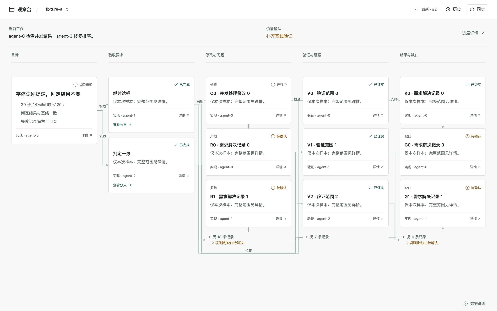
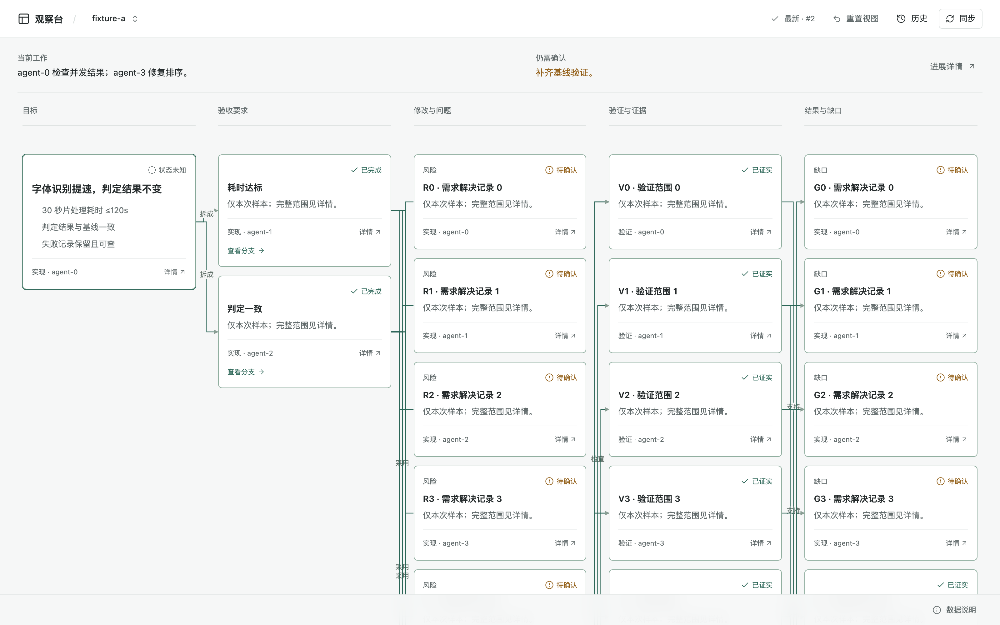
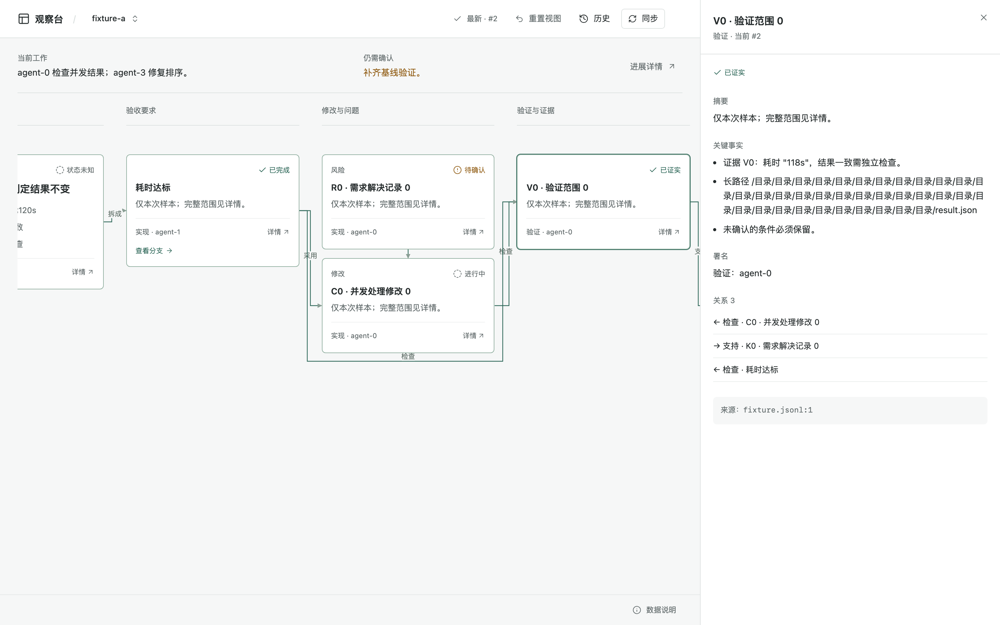

# Agent Sessions Observer

把本机 Claude Code / Codex / Cursor 的会话记录，归纳成一张「需求解决地图」：需求解决到哪一步、谁提供了结果、还缺什么证据，一张图看完。

[](https://github.com/vitoliu93/agent-sessions-observer/actions/workflows/ci.yml)
[](https://www.npmjs.com/package/agent-sessions-obs)
[](https://www.npmjs.com/package/agent-sessions-obs)
[](./LICENSE)

<p align="center">
  
</p>

## 为什么需要它

Agent 跑完一个大任务，过程散落在几十万行的 JSONL 日志里。想知道「这件事办到哪了」就得翻日志、猜上下文。观察台读取本地会话文件，默认交给 Jev 分类画图，再由本机模型 CLI 审图，产出一张多目标地图：

- **五列结构**：目标 → 子目标 → 修改与问题 → 验证 → 结论与缺口；
- **署名与来源**：每张卡写明由哪个会话完成、引用来自输入的哪一行；
- **缺口独立成列**：没被证实的部分单独标出，不和「已完成」混在一起。

模型归纳是线索，不是核实。地图帮你决定去哪里查证，不替你下结论。

## Jev 画图，慢模型审图

两个模型分工，对应《思考，快与慢》里的系统一和系统二：

| | Jev（快） | 慢模型（本机 Codex / Claude / pi） |
|---|---|---|
| 负责 | 整棵树：目标、卡片、类型、状态、连线 | 审这棵树：改写、纠错、重组 |
| 怎么做 | 每个判断出成选择题，并发去问 | 读底稿，交一张按卡片 ID 写的修改单 |
| 多久一次 | 会话一变就重画，1–3 秒 | 第一版底稿出来审一次；之后等 agent 停下来等你、攒了 10 张新卡、或会话安静两个间隔再审。只审新卡，耗时取决于模型 |
| 没有它 | 无 key 时默认用 `--engine cli`；运行中不可用则报错或标出缺卡，不自动换引擎 | 只有底稿，卡片是原话 |

[Jev](https://docs.typesafe.ai) 是只做选择题的模型：不会写字，一次判断约 0.3 秒，价钱近乎免费。画地图这件事全部拆成选择题：

| 要判断的事 | 出给 Jev 的题 |
|---|---|
| 用户这句话算什么 | 单选：新需求 / 接着做 / 推倒重来 / 补充要求 / 不是需求 |
| 这句话里哪几句是要求 | 每句一道判断题 |
| agent 这一步干了什么 | 单选：只是在看 / 改东西 / 跑检查 / 撞上问题 / 向用户汇报 |
| 这一步成没成 | 单选：成了 / 失败 / 没做完 |
| 哪一句最能说明结果、哪一句说的是没做完的事 | 单选：选项就是原文里的句子 |
| agent 说做完了，检查结果撑得住吗 | 判断题，低于 50% 标「证据弱」 |

Jev 的底稿：字全部摘自原文，不会编造；连线由代码按先后顺序连；卡片 ID 取自原始记录的行号，重画不闪、不换位。代价是读起来碎：标题是原话或工具调用的说明，「验收要求」一列只是用户的原句。

慢模型补上这一块。它不重画，只交修改单：

| 修改 | 作用 |
|---|---|
| 改写 | 把原话标题改成一句好读的话；原话留在卡片详情里 |
| 纠正 | Jev 判错的类型、状态改回来，理由写进卡片的系统说明 |
| 并卡 | 说同一件事的几张卡并成一张 |
| 去噪 | 去掉不该成卡的步骤；失败记录不删 |
| 重拆子目标 | 把用户原句换成可独立验收的子目标，卡片重新分配 |
| 改连线 | 补上、去掉连线 |

修改单按卡片 ID 写，Jev 每次重画后重新套用，所以几秒一版的底稿和慢模型的审图互不打架。

审图按目标分开、只审新卡：每个目标一次调用，每个会话最多 3 个目标并行，一轮最多 8 个目标、每个目标最多 60 张卡，审完一个套一个，地图一块一块变好读；审过的卡只给慢模型一行标题当上下文，新交的修改单并进总的。点「同步」丢掉修改单，整张重审。

速度数字是少量样本，不是承诺；超长会话、限流和断网时会更慢。

Jev 的答案和修改单存在 `~/.cache/agent-sessions-obs/<会话 ID>.json`：同格式缓存重启可复用，升级缓存格式会重新判断。原要求内容变了会重审；新要求卡不会被旧分组吞掉。旧要求下新增的步骤暂归最后一个子目标，等下一次审图。修改单里不认识的 ID、类型、状态、动词整条丢掉；审图失败时底稿照常显示。

实测（约 200 条事件的会话）：Jev 4 秒出 51 张卡的底稿；慢模型整审一个 34 张卡的目标 41 秒（改写 23 处、纠正 3 处、拆出 4 个子目标）；之后会话每长出一张新卡，增量审 13 秒。

页面顶部一行写明此刻状态（agent 在读代码、改文件、跑检查、等你回复还是卡住了）和审图状态（底稿 / 审图中 / 已审 · 新增几张待审）。

不留历史版本：几秒一版，旧版没有回看的意义。

其它用法：`--no-review` 只要底稿；`--engine cli` 换回慢模型整张归纳，此时 Jev 退成帮手（判此刻状态、拦下不改图的重新归纳、核对卡片引用的原文）；没有 key 或加 `--no-jev` 时完全不用 Jev；这不等于离线，模型 CLI 仍可能调用远端服务。

## 功能

- **多来源会话**：Claude Code、Codex CLI、Cursor CLI 的本地记录；自动挂载子会话（Agent/Task 派发、Herdr 派发、Codex 子线程）。
- **多目标地图**：一个会话里先后提出的多项需求各自成卡；目标之间用「接着」「推翻」连线。
- **边归纳边显示**：模型流式输出时地图实时生长，写完一张显示一张。
- **聚焦视图**：点任意一张卡，只留下它到目标和结论的整条链路。

<p align="center">
  
  
</p>

- **详情抽屉**：每张卡可展开全部事实、执行步骤、直接关系与来源引用。
- **本地优先**：默认只监听 `127.0.0.1:4173`，页面无外部请求，样式与图标全部打进包里。快判由后端调用，页面不直连。

## 快速开始

前置条件：

- Node 22+；
- 环境变量 `JEV_API_KEY` 或 `TYPESAFE_API_KEY`（Jev 画图）；
- 或者本机装有 [Codex CLI](https://github.com/openai/codex)、Claude Code 或 [pi](https://github.com/badlogic/pi-mono) 之一（`--engine cli`）—— 归纳调用它完成，消耗它的模型额度。

```sh
npx agent-sessions-obs
```

不带参数时，终端列出最近的会话（标题、目录、最后修改时间）：↑↓ 选择、输入文字筛选、回车开始观察。也可以直接给 ID：

```sh
npx agent-sessions-obs <session-id-or-prefix>          # 支持前缀
npx agent-sessions-obs codex://threads/<id>            # 直接粘贴 Codex 复制的链接
bunx agent-sessions-obs <session-id>                   # 装了 Bun 也行
```

然后浏览器打开 `http://127.0.0.1:4173`。端口被占用时用 `--port` 换一个，不会覆盖已有服务。

## 命令行参数

```sh
agent-sessions-obs <id> [<id>…] \
  --port 4174 --interval 60 --budget 400000 \
  --cli codex --model gpt-5.6-luna
```

| 参数 | 默认 | 说明 |
|---|---|---|
| `--port` | `4173` | 监听端口，仅绑定 `127.0.0.1` |
| `--interval` | `60` | 慢模型两次运行的最短间隔秒数（审图或整张归纳）；不用 Jev 时也是检查文件变化的间隔。整图失败后退避 5 秒至 5 分钟；审图按该间隔加倍退避（最长为 5 分钟或该间隔中的较大值），连续三轮全部失败暂停，点同步重试 |
| `--budget` | `400000` | 压缩后事件流的字符上限；短会话的余量让给长会话 |
| `--cli` | 自动 | 审图、归纳用的 CLI：`codex` / `claude` / `pi`，默认取本机已装的第一个 |
| `--model` | 见下 | Codex 默认 `gpt-5.6-luna`，Claude 默认 `haiku`，`pi` 用自身配置 |
| `--engine` | 自动 | 地图由谁画：`jev` / `cli`。有 `JEV_API_KEY` / `TYPESAFE_API_KEY` 时默认 `jev` |
| `--no-review` | 关 | Jev 画图时不让慢模型审图；没装模型 CLI 时本来就不审 |
| `--no-jev` | 关 | 完全不用 Jev，等于 `--engine cli` 且关掉此刻状态、把关、证据核对 |

也可用环境变量 `OBS_CLI`、`OBS_MODEL`、`OBS_PROVIDER` 覆盖。

## 会话从哪里读

| 来源 | 位置 | 说明 |
|---|---|---|
| Claude Code | `~/.claude/projects/**/*.jsonl` | 标题取 `custom-title`，其次 `ai-title` |
| Codex CLI | `~/.codex/sessions/`（含 `archived_sessions/`） | 子 agent 按 `parent_thread_id` 挂载；ID 前 8 位是时间戳，撞前缀时给更长前缀 |
| Cursor CLI | `~/.cursor/projects/*/agent-transcripts/*/*.jsonl` | IDE 内的 SQLite 聊天库不解析 |

子会话关联：原生 Agent/Task 优先用工具结果里的 `agentId` 精确挂载；Herdr 派发按时间窗口与工作目录匹配，出现两个候选就报歧义，不瞎选。文本匹配是线索，不是身份证明；定位不了就显示未定位。临时目录（`/tmp` 等）下的会话不在列表里。

## 工作原理

Jev 画图（默认）：

1. 读取会话 JSONL，连同能明确关联的子会话；
2. 主会话按用户发言切成回合；agent 每说一段话、或每一次「调用 → 回包」算一步；子会话的步骤按时间落进回合；
3. 第一轮并发问 Jev：每条用户发言和前面的需求是什么关系、哪几句是要求、哪一句当标题；
4. 第二轮并发问 Jev：每一步干了什么、成没成、为哪条要求；回合收尾的一步再问哪句是结果、有没有留尾巴；
5. 代码组装：同一回合里连着的同类步骤并成一张卡，按先后连线；回合最后一次检查通过，撞过的问题记为已解决；
6. 有修改单就套上去，再按地图规则校验一遍，不合规的连线丢掉；
7. 结论卡拿同一回合的检查结果再问一次 Jev，写入证据支持度；
8. 答案按材料与题目缓存，最多每 5 秒看一次文件（更小的 `--interval` 会缩短检查间隔）；变了就重画，图没变不出新版本；
9. 所有 Jev 请求共用 8 路并发；单题排队加重试最多 40 秒，画底稿最多 60 秒，超时保留上次结果；
10. 慢模型审图在队列外单独跑，不挡重画；审完把修改单存下，立刻重画一次套上去。

慢模型归纳（`--engine cli`）：

1. 按 `--budget` 压缩事件流：各会话保留身份与头尾，剩余额度交给长会话；
2. 调用本机模型 CLI 归纳，流式输出地图 JSON，页面边写边渲染；
3. 严格校验输出：不合规的卡、边、署名、引用剔除并记入系统说明，整体不合法则整版拒绝；坏输出不覆盖上一版地图；
4. 有 key 时每 10 秒让 Jev 看一次新事件，改图的可能到 30% 或新事件超过 12000 字才重新归纳；Jev 连不上就退回「文件一变就归纳」；
5. 归纳完成后，Jev 逐张核对已完成卡片引用的原文，写入证据支持度。

## 隐私与安全

- 页面和会话读取在本机运行，不是全部离线。观察台只读会话文件，缓存与归纳失败原文写入 `~/.cache/agent-sessions-obs/`；服务只监听回环地址，页面无外部请求；
- 用 Jev 时，用户发言、agent 原话、工具名称与参数、回包片段、卡片标题与事实会发到 `api.typesafe.ai`。未做秘密字段清洗，原文里的密钥、路径也可能外发。SDK 支持 `TYPESAFE_BASE_URL`，设置后会发往该地址；`--no-jev` 只关闭 Jev，不关闭模型 CLI 的外发；
- 归纳与审图会把会话内容发给指定模型 CLI（消耗其额度，是否联网由 CLI 配置决定）。Claude 只开放 Read/Grep/Glob，pi 只开放 read/grep，两者都不开放 shell，禁用外部 MCP 或扩展并关闭会话保存；Codex 使用只读沙箱、不接受审批、不保存线程。只读工具仍可能读到项目内容，不要观察来源不明或含秘密的日志；
- 缓存含原文摘句、用户要求与改写，不是无敏感内容的索引。新写文件权限 0600、目录 0700；失败原文也按此保存。每次启动清一次：会话缓存 30 天没动就删，失败原文留 7 天，正在观察的会话不会被清掉；只清这个目录里自己命名的普通文件，旧版本留在 `/tmp/obs-failed-*` 的不管；
- 卡片状态不等于验收通过：模型的归纳受原始记录质量影响，结论仍需人工或测试确认。

## 已知限制

- 单个会话文件最多 64 MiB，超过会报错，不会悄悄截掉；多个文件的总内存仍未设限。仍按整文件读取，不是增量读取；
- 两个观察台看同一会话时不会混写半份缓存，但最后保存的版本会覆盖前一个，不合并修改单；
- Jev 并发上限不是每分钟请求额度；真实限流时依赖 SDK 重试与整轮退避；
- 慢模型最长运行 10 分钟，超时杀掉本轮进程；多个会话的审图并行数没有总上限；
- 按顺序连出的“支持/解决”是查证线索，不能证明两个动作有因果关系；
- Cursor 目前只作为派发的子会话挂载，不能用它的 ID 直接作为主会话打开；

- 缓存文件不会自己过期：Jev 换了版本想重判，删掉 `~/.cache/agent-sessions-obs/` 下对应文件；
- 新卡在审到之前按原话显示；
- Codex 子 agent 收到的任务正文是加密的，只能看到它的执行过程和明文回报；
- Jev 画的图，卡片文字是原话不是归纳；一步被判错类，就会少一张卡或多一张卡；
- Jev 给的是概率判断，Jev 以英文训练为主，中文记录的准确度低一些；「证据弱」是提醒去查，不是判定造假；
- 事件流有压缩与截断，覆盖说明会列出缺失部分，地图不能替代逐条日志；
- 会话子会话匹配、卡片 ID 延续与结论质量仍受原始记录与模型能力影响。

## 开发

需要 Bun 1.2+ 和 Node 22+；浏览器测试由 Playwright 在 Node 下运行。

```sh
bun install
bun run dev:web              # 终端 1：监听 Tailwind 与前端
bun run dev:cli <session-id> # 终端 2：后端改动后自动重启
bun run typecheck            # TypeScript 严格模式检查
bun run test                 # 后端单元与 HTTP 测试
bun run build && bun run test:web   # 打包后跑前端浏览器测试
```

目录：`src/shared` 前后端数据契约；`src/cli` 会话解析、归纳、Jev 画图（`jevmap.ts`）、慢模型审图（`review.ts`）、快判（`jev.ts`）与 HTTP 服务；`src/web` React 页面。发布产物只有 `dist-cli/`，单文件入口 + 静态前端，安装时不拉依赖。

浏览器测试先装一次 Chromium：`bunx playwright install --only-shell chromium`，或用 `OBS_BROWSER` 指定本机已有路径。测试全程拦截网络，不连接任何真实服务。

README 里的截图由脚本生成（构建前端后运行）：

```sh
bun run build:web && bun scripts/screenshot.ts
```

## 文档

- 设计文档：[docs/design](docs/design)
- UI 方案与产品质量约定：[docs/advanced-plans](docs/advanced-plans)

## 贡献

欢迎 Issue 和 PR。提交前请跑通 `bun run typecheck` 与 `bun run test`。

## License

[MIT](./LICENSE)
